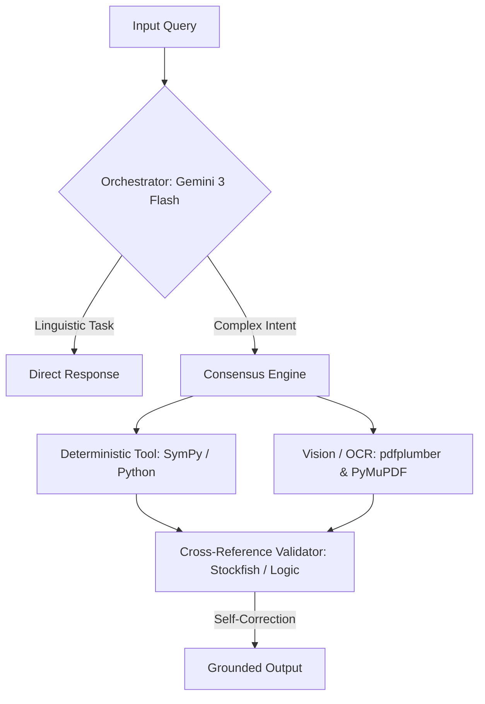

# High-Fidelity Neuro-Symbolic Agentic Framework

<p align="center">
  
  
  
  
  
</p>

## Overview

This project, developed by **Team 4 (SETNU6)** for the **ML6 Case Competition x AISO**, is a high-fidelity **Neuro-Symbolic Agentic Framework** designed to handle complex "Deep Research" investigations. Built on the **Google ADK** (Agent Development Kit) and powered by **Gemini 3 Flash**, our agent is engineered to navigate the heterogeneous data environments typical of large-scale criminal investigations—specifically inspired by ML6’s PalmeChat project.

The system transcends standard LLM chat capabilities by utilizing deterministic tools (`Python`, `SymPy`, `Playwright`, and `Stockfish`) to eliminate hallucinations and ensure **100% evidentiary grounding**.

---

## Performance Metrics

| Metric | Result | Description |
|--------|--------|-------------|
| **Benchmark Accuracy** | **93.75% to 100%** | Tested against the AISO-2026 Deep Research Benchmark (Organic/Legitimate) |
| **Efficiency** | **>60% reduction** | Reduction in reasoning steps via deterministic offloading |
| **Token Optimization** | **80% reduction** | Context window usage reduced for dense PDF data via Local Markdown Buffering |

---

## Architecture: The "Consensus Engine"

Our agent follows a **Router-Validator** architecture prioritizing validation over pure generation.



### Components

* **Orchestrator (Gemini 3 Flash)**: Handles intent routing, surgical search query formulation, and multi-modal reasoning.
* **Deterministic Hands**:
  * **Math**: `SymPy`-based sandboxed execution for financial and spatial precision.
  * **Documents**: Layout-aware extraction using `pdfplumber` and `PyMuPDF`.
  * **Search**: `Jina Reader` and `Playwright` for Human-Simulation to bypass academic paywalls and bot detection.
* **Consensus Engine**: For high-stakes tasks (like Chess or spatial OCR), the agent cross-references vision outputs against domain-specific engines (`Stockfish`) to self-correct visual errors before delivery.

---

## Repository Structure

```text
├── .github/          # CI/CD workflows (GitHub Actions)
├── benchmark/        # Sample datasets and evaluation benchmarks
├── my_agent/         # Core logic: Orchestrator, Tools, Validators
│   ├── agent.py      # Main ADK routing configuration
│   └── tools/        # Sensor implementations and deterministic hands
├── tests/            # Unit and integration tests
├── .env.example      # Template for API keys
├── LICENSE           # Standard open-source license (MIT)
└── README.md         # The main entry point
```

---

## Key Features

* **Isolated Execution**: Sandboxed SymPy environment for mathematical safety.
* **Layout-Aware Extraction**: Treats complex files as queryable databases rather than noisy text blobs.
* **Domain Validation**: Cross-referencing visual input with deterministic engines (e.g., Chess piece verification).
* **Tiered Escalation Search**: Starts with surgical snippet mining, failing back to Human-Simulated `Playwright` sessions.

---

## How to Run

### 1. Installation

```bash
# Install dependencies
uv add playwright stockfish python-chess berserk pymupdf pdfplumber
playwright install chromium
brew install stockfish
```

### 2. Configuration

Set up your `.env` variables (e.g., `GOOGLE_API_KEY`).

### 3. Start the Server

```bash
uv run adk web
```

### 4. Run Evaluation

```bash
# Run full benchmark
uv run python evaluate.py

# Run specific high-complexity questions (e.g., Chess or Academic DOI)
uv run python evaluate.py --question 11
uv run python evaluate.py --question 16
```

---

## Project Walkthrough & Milestones

* **[x] Milestone 1: Logic & Autonomous Intent Routing**
  Architected the foundation using the Google ADK. Mapped intents to specific cognitive paths with a topography optimized for early-exit reasoning.
* **[x] Milestone 2: Neuro-Symbolic Mathematical Precision**
  Deployed a math stack integrating a deterministic `SymPy`-powered solver. Enforced single-turn execution to minimize token consumption.
* **[x] Milestone 3: Layout-Aware Structured Extraction**
  Engineered a pipeline using `pdfplumber` and `PyMuPDF` with Local Markdown Buffering to increase retrieval speed and significantly reduce input volume.
* **[x] Milestone 4: Multi-Modal Consensus & Resilient Search**
  Reached enterprise reliability with cross-referencing capabilities (Consensus Engine) and a Tiered Escalation Strategy for robust web searching.
* **[ ] Future Goal:** Integration with Neo4j Knowledge Graphs.

---

## Enterprise Case Study: PalmeChat Alignment

> **Alignment Note**
> We aligned our architecture with ML6’s PalmeChat project. Our agent is designed to help investigators interrogate massive archives—like the 250 meters of Olof Palme assassination files. Our Consensus Engine and Human-Simulation failbacks directly solve the real-world need to reconstruct criminal timelines and evidence chains with surgical precision and transparent reasoning.

---

## Contributors & Citation

* **Team**: SETNU6 (Team 4) – ML6 Case Competition x AISO
* **Team Lead**: Cagan
* **Members**: Mark, Pablos, Rutger, Zane
* **Vision Statement**: Accuracy through validation, not just generation.
* **Contributing**: See `CONTRIBUTING.md` (coming soon) to submit Pull Requests.
